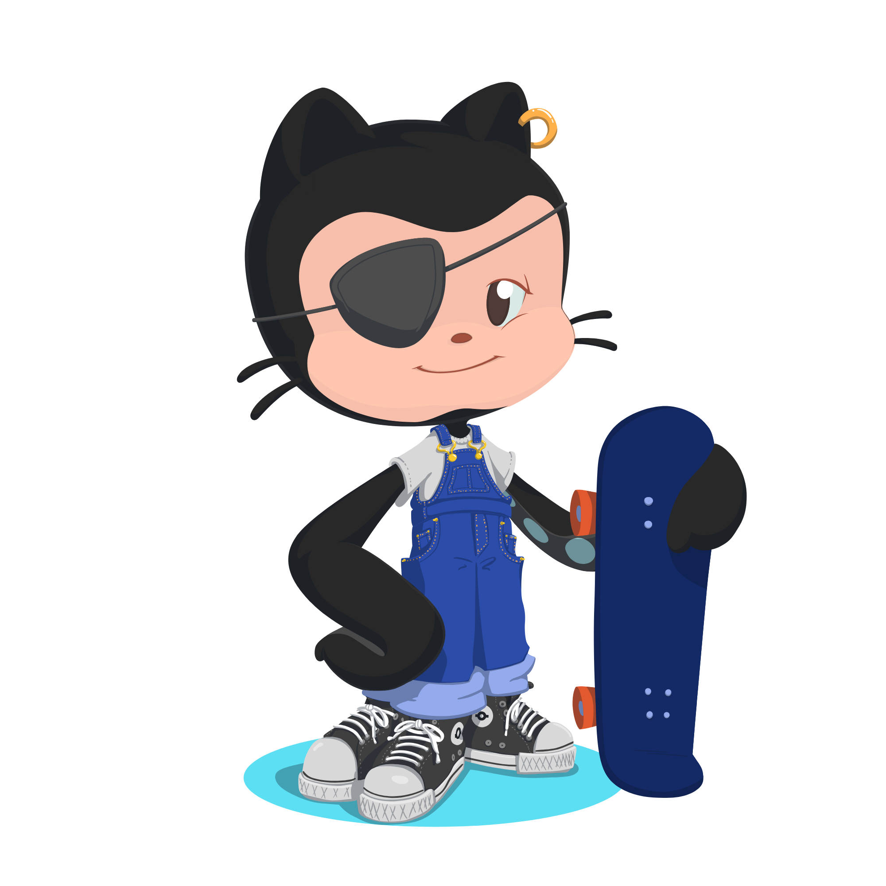

  

  
  

  

  
   
  

  
  

    
Hello internet users! How are you?

    
Well, you're accessing my GitHub for some purpose, right? 

    
This is where you'll find the repository for most of my projects, so feel free to access them to find out more about my work.

    <h4>Main technologies:</h4>
    

    <a href="https://skillicons.dev">
    
     
    <h4>Main langs:</h4>
    
  

  <h3 align="center">Social Media:</h3>
     

