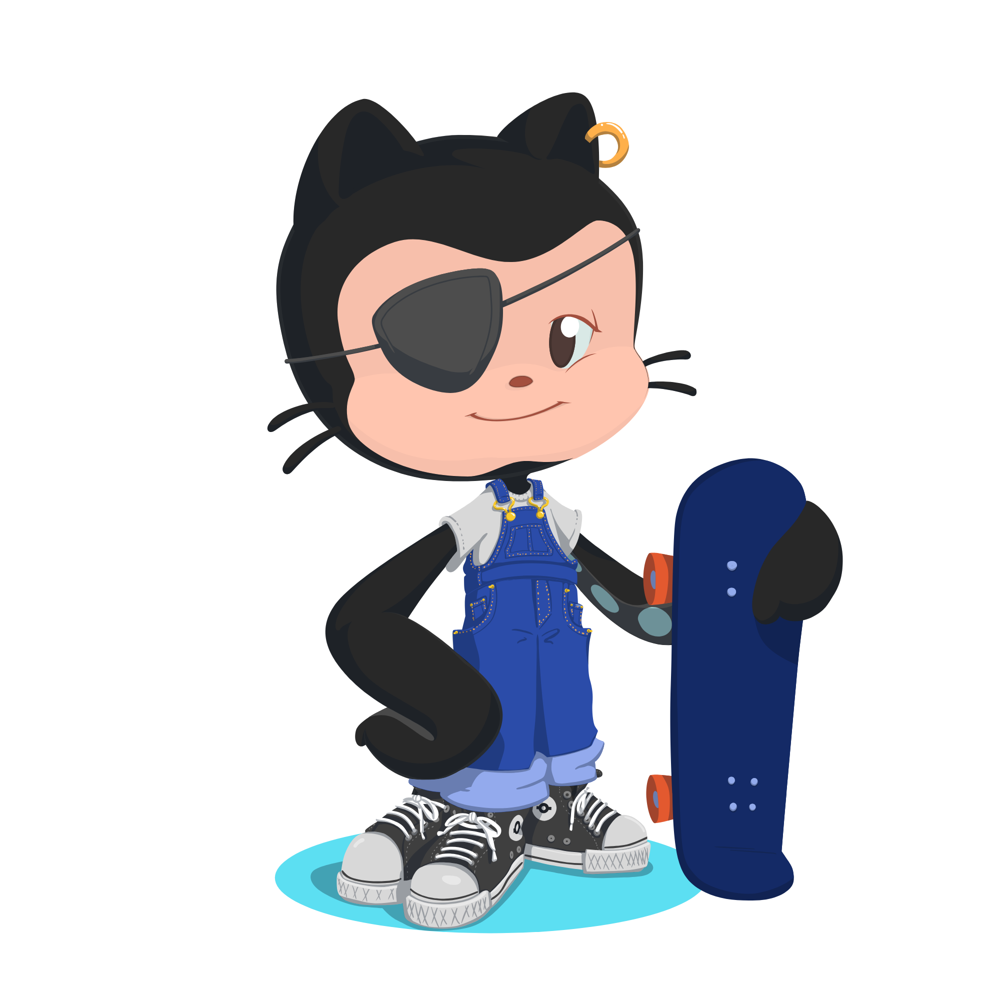

  
  

  

  
   
  

  
  

    
Hey there! Welcome to my GitHub 👋

    
I'm a Full Stack Developer specialized in TypeScript, working across the whole stack with React, Next.js, Nest.js and PostgreSQL.

    
I've built SaaS products for healthcare and fintech, and I'm currently the founder & developer behind <strong>ANIMAPS</strong>, a platform for responsible pet adoption and animal management.

    
Feel free to explore my repositories to see more of my work — and take a look around!

    

    <h4>Main technologies:</h4>
    

    
     
    <h4>Main langs:</h4>
    
  

<h3 align="center">Social Media & Portfolio</h3>

  
  
  

